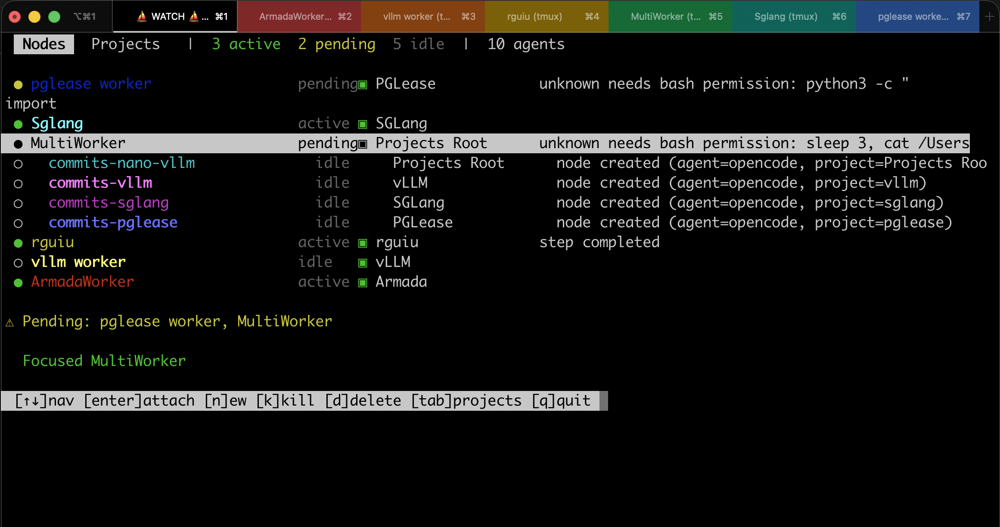

# Raul Guiu

**Staff Software Engineer** with 25+ years building distributed systems across finance, gaming, e-commerce, and AI infrastructure.

Currently at **Ebury** (FX derivatives). Previously **Amazon**, **Betfair**, **VISA**, **Nokia**.

Physics degree. Python and distributed systems at scale.

---

### Featured Projects

<table>
<tr>
<td width="50%">

#### [`armada-ai`](https://github.com/rguiu/armada)

**Terminal orchestration for AI coding agents.**

Run AI agents (OpenCode, Claude Code) in persistent tmux sessions, managed from a web dashboard or REST API. Agents spawn child workers, delegate subtasks in parallel, and survive restarts. Connect from any device.

- Web dashboard with real-time WebSocket updates
- Orchestrator/worker pattern for multi-agent pipelines
- CLI with htop-style TUI (`armada watch`)
- Prometheus metrics, token auth, SQLite WAL backend
- Published on [PyPI](https://pypi.org/project/armada-ai/)

</td>
<td width="50%">

#### [`pglease`](https://github.com/rguiu/pglease)

**Distributed task coordination using PostgreSQL.**

Ensures singleton execution across Kubernetes pods, workers, or processes. No Redis, no ZooKeeper. Uses your existing PostgreSQL with lease-based locking, automatic heartbeats, and TTL failover.

- `@singleton_task` decorator and context manager APIs
- Sync + async (asyncio) support
- Advisory lock hybrid mode for sub-second failover
- Thread-safe, framework-agnostic (Django, Flask, FastAPI, Celery)
- Published on [PyPI](https://pypi.org/project/pglease/)

</td>
</tr>
</table>

---

### Career Highlights

| Company | Impact |
|---|---|
| **Ebury** | Digitising dealer workflows for FX derivatives across 30+ markets |
| **BoldPlay** | Led backoffice and analytics teams. Drove system decoupling across squads, built CI/CD from scratch, and created developer tooling that eliminated repetitive tasks for game developers. Improved shared game libraries used across 100+ titles |
| **Virtue Poker** | Designed fully serverless AWS architecture from scratch. P2P via AWS IoT, real-time analytics pipeline |
| **Amazon** | Launched Amazon Business in Germany, Japan, and UK. Built VAT calculation for the EU cart |
| **Betfair** | Real-time AJAX pricing on Europe's highest-traffic betting exchange |
| **VISA** | Clearing & Settlement systems for global payments |

---

### What I Think About

Getting multiple coding agents to work together without stepping on each other. Persistent sessions, task splitting, knowing when something failed and picking it back up.

Using PostgreSQL for things people reach for Redis or ZooKeeper for. Advisory locks do more than most teams realise.

How inference actually works under the hood: KV caches, batching strategies, routing requests to the right model at the right time.

---

### Stack

`Python` `Java` `TypeScript` `AWS` `PostgreSQL` `Redis` `Docker` `Kubernetes` `asyncio` `FastAPI` `Distributed Systems`

---

